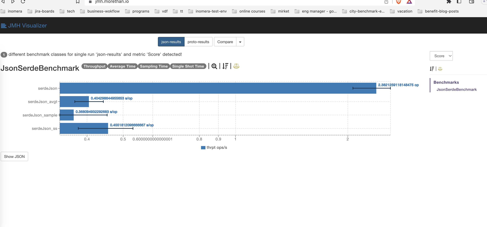
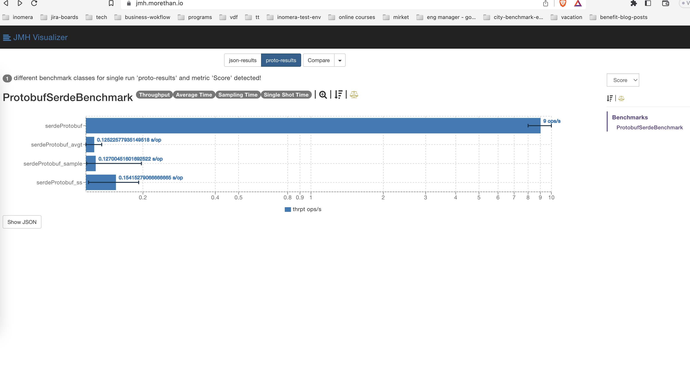

# Java Protobuf vs Json Serialization/Deserialization benchmark

* Serialization is a mechanism of converting the state of an object into a byte stream. 
    
* Deserialization is the reverse process where the byte stream is used to recreate the actual Java object in memory.

## Usage

    ./gradlew clean build -x test

If you do not skip tests, you have to wait the build time of unit test  

## JUNIT Test Benchmark Samples

 Execute class level with concurrent

## JMH Benchmark 

Install plugin for Intellij IDEA or execute in the Benchmarks' main methods

### Case 1 : One, five, ten million iterations five times

#### Json Results

    Iteration : 1000000=[
    json : 1941 ms,
    json : 1695 ms,
    json : 2093 ms,
    json : 1739 ms,
    json : 1900 ms]
    
    Iteration : 5000000=[
    json : 9154 ms,
    json : 8421 ms,
    json : 10629 ms,
    json : 9814 ms,
    json : 9644 ms]
    
    Iteration : 10000000=[
    json : 18080 ms,
    json : 19905 ms,
    json : 17498 ms,
    json : 19201 ms,
    json : 19582 ms]

    Iteration : 1000000 -> json average : 1873.6
    Iteration : 5000000 -> json average : 9532.4
    Iteration : 10000000 -> json average : 18853.2

#### Protobuf Results

    Iteration : 1000000=[
    protobuf : 630 ms,
    protobuf : 465 ms,
    protobuf : 424 ms,
    protobuf : 430 ms,
    protobuf : 379 ms]
    
    Iteration : 5000000=[
    protobuf : 2044 ms,
    protobuf : 2845 ms,
    protobuf : 1864 ms,
    protobuf : 1849 ms,
    protobuf : 1804 ms]
    
    Iteration : 10000000=[
    protobuf : 4580 ms,
    protobuf : 3698 ms,
    protobuf : 3718 ms,
    protobuf : 3571 ms,
    protobuf : 3510 ms]

    Iteration : 1000000 -> proto average : 465.6
    Iteration : 5000000 -> proto average : 2081.2
    Iteration : 10000000 -> proto average : 3815.4

### Outputs

- Overall result that protobuf is >4x faster than json
- When iteration count increases, protobuf performs better

## JSON & Protobuf Benchmark

json and protobuf benchmark output files are json-results.json and proto-results.json

You can use the following address to visualize the metrics.

https://jmh.morethan.io/

Output meanings are;

* Throughput : Operations per unit of time - the higher the bars, the better
* Average Time : Average time per operation - the lower the bars, the better
* Sampling Time : Samples the time for each operation - the lower the bars, the better
* Single Shot Time : Measures the time for a single operation - the lower the bars, the better

### Outputs

* Throughput : Json [2.38] - Protobuf [9] -> protobuf >3.7x better than json
* Average Time : Json [0.40] - Protobuf [0.12] -> protobuf >3.3x better than json
* Sampling Time : Json [0.36] - Protobuf [0.12] -> protobuf >3x better than json
* Single Shot Time : Json [0.45] - Protobuf [0.15] -> protobuf >3x better than json

## Tools & Resources

### Tools

- Intellij IDEA
- OpenJDK 64-Bit Server VM, version : 17.0.2

### Resources

- Macbook Pro 15' 2018
- 2,6 GHz 6-Core Intel Core i7
- 16 GB 2400 MHz DDR4

## References    
* https://github.com/openjdk/jmh
* https://junit.org/junit5/
* https://www.geeksforgeeks.org/serialization-in-java/
* https://jmh.morethan.io/

